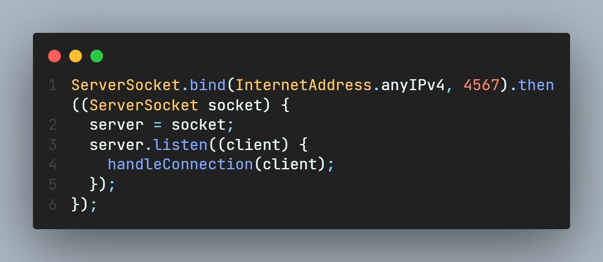
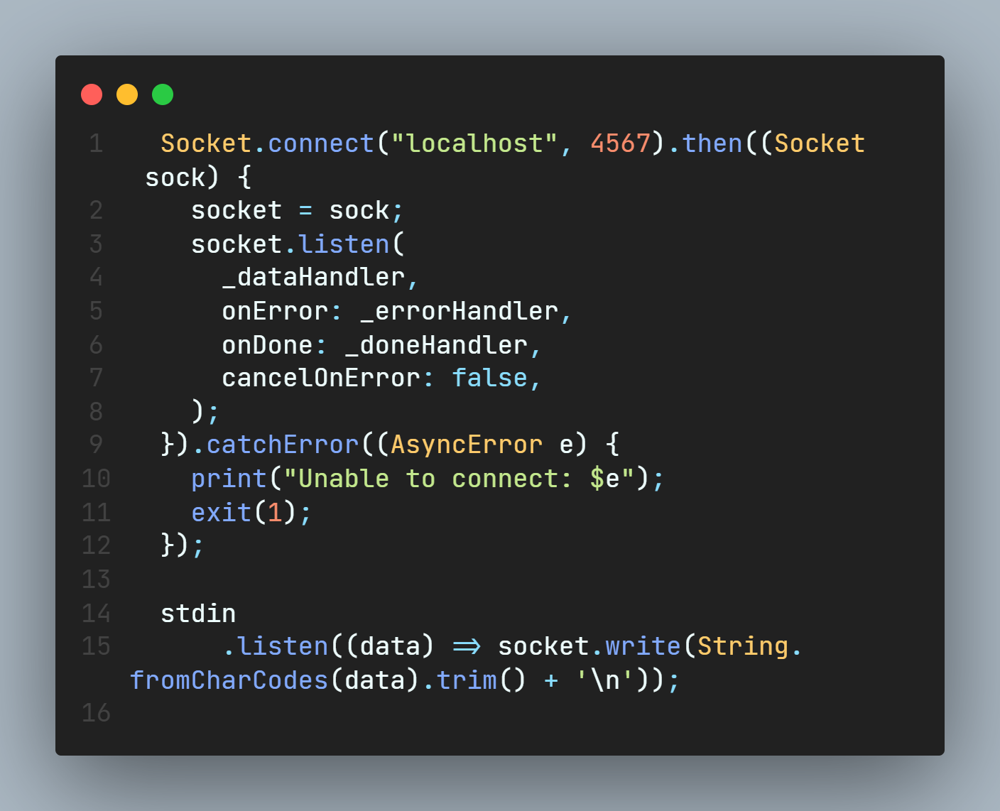
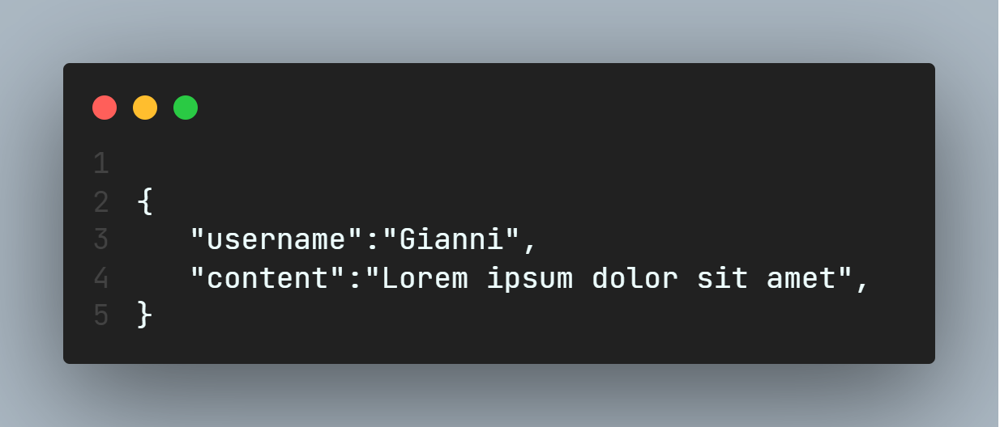
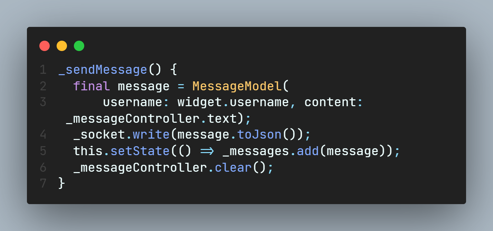
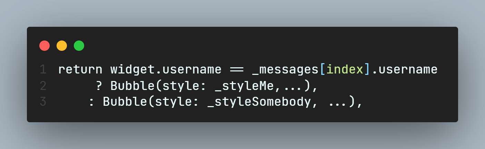
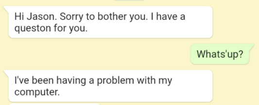

# Chatroom

Realizzazione di una chatroom utilizzando i socket di dart.

---

## Creazione del server

Un server è un programma per computer o un dispositivo che fornisce un servizio ad un altro programma per computer e al suo utente, noto anche come client.

Per creare il server mi sono affidato alla classe Socket di dart, che permette la connessione del socket locale ad altri socket remoti.

 

Per inizializzare il server si procede a inizializzare il socket all'indirizzo e alla porta che vogliamo dare al server. Il server così è pronto ad ascoltare tutte le chiamate. 

Il codice per fare ciò:

---

## Creazione del client

Un client è un computer che si connette e utilizza le risorse di un computer remoto, o server. 

 

Per inizializzare il client bisogna connettere il socket al socket del server, questo è possibile connettendo il client alla stessa porta del server.
Finita la configurazione si procede alla lettura dei dati contenuti nel server.

Il codice per farlo:

--- 

## Parte grafica

Una volta fatti comunicare il server e il client bisogna procedere alla parte grafica.

#### Funzionamento 

Appena aperta l'app viene richiesto il login con il proprio nome, così da mostrare il proprio nome all'interno della chatroom, che viene aperta non appena si schiaccia il tasto **"Login"**. 
All'interno della chat puoi mandare messaggi e riceverli dagli eventuali altri utenti. 

#### Passaggio dei dati 

Il passaggio dei dati avviene mediante JSON che ha 2 key: il nome utente e il messaggio.

Esempio di messaggio:

Il modello usato per ogni messaggio è contenuto nel file "message_model.dart".

#### Invio dei dati

Per inviare i dati si utilizza il "message model" e lo si aggiunge alla lista di tutti i messaggi ricevuti/inviati.

I messaggi sono dunque inviati in questo modo: 

#### Grafica di ogni messaggio

Per mostrare ogni messaggio mi sono affidato alla libreria "bubble" di dart, che mi ha permesso di fare in modo semplice, veloce e bello il design di ogni messaggio, che sia esso iniviato o ricevuto. 

Per vedere se il messaggio è stato inviato o ricevuto si confronta l'username in questo modo:

---

## Risultato finale

